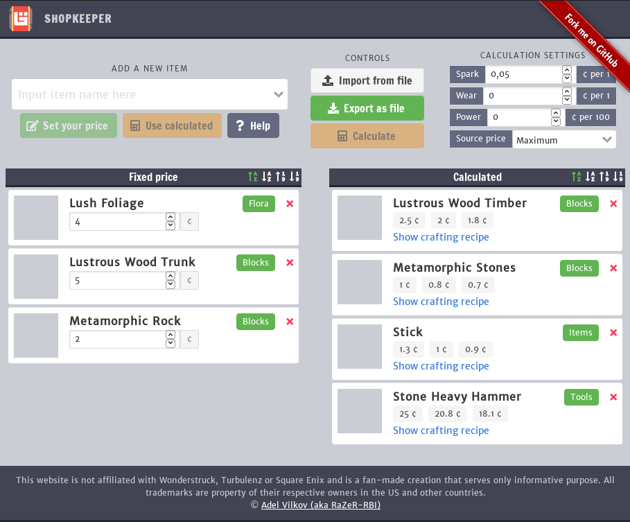

This is a tool for the [Boundless]("https://playboundless.com/") game. It can help you to calculate the price of craftable items based on the
ingredients used.

### [Click to launch!](https://razer-rbi.github.io/boundless-shopkeeper/)



### Reporting issues
If you found a bug, have a suggestion or just want to say thanks in an original way, feel free to open up an issue on the tab above :) No one will get hurt, I promise!

### Development
Want to tinker with it? No problem - just use:
```
npm install
```
To launch a dev server with hot reloading, use:
```
npm run dev
```
To build, use:
```
# for development
npm run build 
# for production
npm run build-prod
```

Have fun!